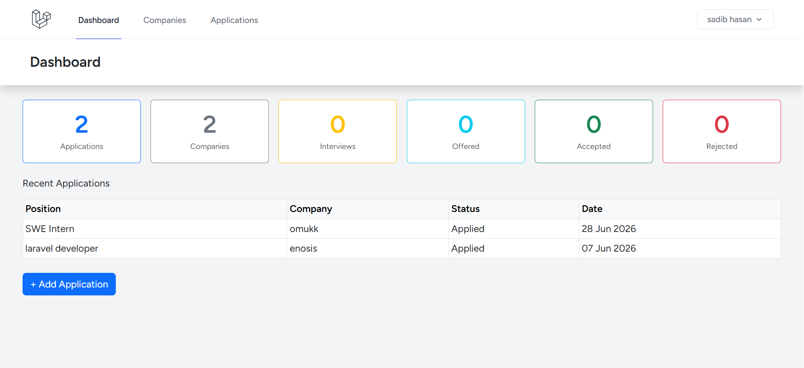

# Job Application Tracker

A full-stack web application built with **Laravel** and **MySQL** to help users manage their job search. I built it for myself to keep track of the jobs i applied, interviewed or scheduled. It reduces my hassle and help me visualize the tracking. 

##

##

## Features
- User authentication (register, login, logout)
- Company management (CRUD)
- Job application tracking with status updates
- Dashboard with application statistics
- Search by position/company, filter by status
- Ownership-based authorization — users only see their own data
- Bootstrap

## Tech Stack
- **Backend:** Laravel 12, PHP 8+
- **Database:** MySQL with Eloquent ORM
- **Frontend:** Blade Templates, Bootstrap 5
- **Auth:** Laravel Breeze

## Database Design
Users → Companies → Applications (with direct user_id on applications for security)

## Setup Instructions
1. Clone the repo
2. Run `composer install`
3. Copy `.env.example` to `.env` and configure your database
4. Run `php artisan key:generate`
5. Run `php artisan migrate`
6. Run `npm install && npm run build`
7. Run `php artisan serve`

